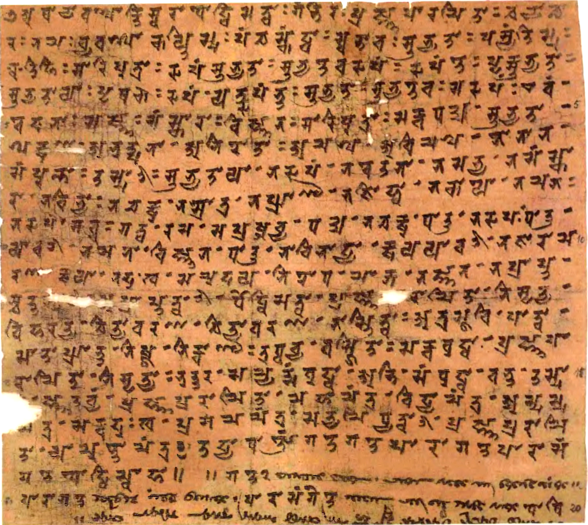

    <h1>Welcome!</h1>
    
I'm a software developer by profession and I've been exposed to a range of technologies and languages throughout my career. Currently on a short career break I'm using my free time to delve into new languages and areas such as Scala, Node, and Swift/iOS, and other topics like Crypotography and CSS and learning Tibetan. This is a small site for hosting my blog on these new language explorations and programming in general.

  

    <h2 class="featurette-heading">Tibetan Blog <small>Learning Standard Modern and How to Read Classical Tibetan</small></h2>
    
Bemused by the loss of the Tibetan for Language Students website this little site has been set up as a place to collate materials for learning to read Classical Tibetan.
    

    
At present the site is under construction, but it's hoped with time there will
    be a simple Extended Wylie Markdown down editor for creating your own resources
     (or practice writing) or contributing, a collection of lessons as I learn Standard Modern Tibetan and how to read
     Classical Tibetan myself, and later on an area to test out knowledge or alphabet (in UChen script), vocabulary and even simple translations.
     

     
Being a novice I can't make any guarantees that the material on this site is correct. If you notice any errors or omissions than I offer humble apologies.
     

  

  

    
  

  

    
    <h2 class="text-center">Learning Tibetan Journey</h2>
    
Blog posts and staged lessons.

    
<a class="btn btn-default" href="{{site.baseurl}}/lesson/index.html" role="button">View details &raquo;</a>

  
<!-- /.col-lg-4 -->
  

    
    <h2 class="text-center">Resources</h2>
    
A collection of resources that you may find helpful when learning Tibetan.

    
<a class="btn btn-default" href="{{site.baseurl}}/resource/index.html" role="button">View details &raquo;</a>

  
<!-- /.col-lg-4 -->
  

    
    <h2 class="text-center">Write</h2>
    
Topics about writing.

    
<a class="btn btn-default" href="{{site.baseurl}}/write/index.html" role="button">View details &raquo;</a>

    
<a class="btn btn-default" href="{{site.baseurl}}/write/editor.html?layout=private" role="button">Wylie Editor &raquo;</a>

  
<!-- /.col-lg-4 -->

<!-- /.row -->

<!-- /.row -->
  

    
    <h2 class="text-center">Musings</h2>
    
Thoughts on learning tibetan, about creating this site and news.

    
<a class="btn btn-default" href="{{site.baseurl}}/blog/index.html" role="button">View details &raquo;</a>

  
<!-- /.col-lg-4 -->
  

    
    <h2 class="text-center">Games</h2>
    
Simple games to help learn new words and hopefully later reading simple stories.

    
<a class="btn btn-default" href="{{site.baseurl}}/game/index.html" role="button">View details &raquo;</a>

  
<!-- /.col-lg-4 -->    

